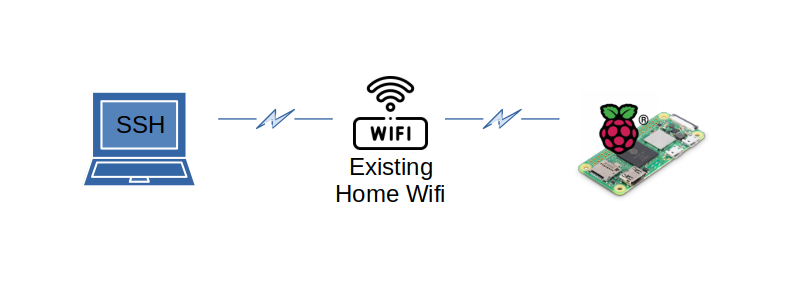
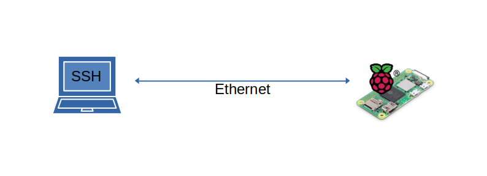
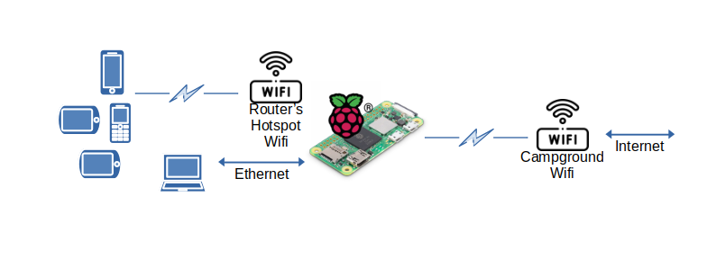

# Raspberry Pi RV Router with ALFA

This document is about setting up a small router for an RV that uses a long range dual band wifi adapter for connecting to a RV park wifi service.  

## Prerequisites:

To setup the Pi to act as a RV router with the ALFA Tube, make sure you have these:

- [ ] Raspberry Pi: Purchase it via [raspberrypi.com](https://www.raspberrypi.com/products/raspberry-pi-zero-2-w/).  This process is tested with the Zero 2 W.  However, a 4 model B or 5 will most likely also work.  

- [ ] Case: A case is not required, but it is recommended.  Some cases come with heat sink to help keep your Pi a little cooler.  

- [ ] Power supply: A micro USB power supply with at least 2.5A at 5v of power.  Some cell phone chargers are compatible.  If you have a spare compatible charger, you can use that.

- [ ] SD Card: You need a 32GB or larger micro SD card.  Recommend a Kingston or SanDIsk.  If you already have one, you can use that.  This process will delete its content.  

- [ ] If using a Zero 2 W, you will need extra USB ports and an Ethernet adapter. This procedure was tested with a [Smays Micro USB OTG to Ethernet Adapter with Powered Hub](https://www.amazon.com/dp/B00L32UUJK/ref=sspa_dk_detail_4).  But lots of other brands will likely also work.  

- [ ] Small unused Ethernet hub with two patch cables or a single Ethernet crossover cable.  

- [ ] The [ALFA Tube-UAC2 with antenna](https://store.rokland.com/products/alfa-tube-uac2-802-11ac-dual-band-2-4-5-ghz-long-range-usb-adapter-9-dbi-omni-antenna-kit-1?variant=31281536303187), available from Rokland.

For your laptop or desktop computer:

- [ ] Adapter: Make sure your desktop/laptop computer has a SD card reader/writer.  If not, you can purchase a USB to Micro SD adapter for about $10.  

- [ ] An Ethernet port.

- [ ] A Wifi adapter.

- [ ] Download and Install: The Raspberry Pi Imager software.  It will write the Ubuntu server software to the SD card.  Get it from from [raspberrypi.com/software](https://www.raspberrypi.com/software/).  

- [ ] An SSH client.  A popular client is [Putty](https://putty.software/).  Modern operating systems have an SSH client built in.  

## Operating System Install

We'll initially setup the Raspberry Pi as a headless (no keyboard or monitor) Ubuntu server.  

Follow these steps to install and configure Ubuntu:

1. Insert the SD card into your laptop/desktop reader or adapter.  

2. Open the Raspberry Pi Imager application.

3. Select your device, Raspberry Pi Zero 2 W or other.

4. Select the OS, under "Other General-purpose OS", select the Ubuntu Server 24.04  LTS version, 64-bit.  

5. Select the storage device as the SD card you inserted in step 1.

6. Select Customization and enter the following:
   
   1. A host name, i.e. "raspi02w" or something like that.
   
   2. Localization for timezone and keyboard type (despite no keyboard!)
   
   3. User name and password for logon
   
   4. Enter Wifi SSID and password.  It needs to be a for a 2.4GHz network.  If unsure, logon to your router to confirm.  Look for the wireless or Wifi settings section.  
   
   5. Enable SSH and use password authentication.

7. Write the image to the SD card.

8. Once done, remove the SD card from laptop/desktop and insert into the Raspberry Pi.

9. If it's a Raspberry Pi Zero 2 W, also attach the Ethernet adapter with USB hub.  

10. Power on the Raspberry Pi.

11. Logon to your local router and check for current IP addresses.  It may be under DHCP or current clients or other.  

12. Look for the "raspi02w" or other name you gave it and note the IP address.  

13. Open your SSH client and connect to the IP address.
    

14. Logon using the ID and password set in step 6.3.  

15. Need some updates:
    
    ```bash
    sudo apt update && sudo apt upgrade
    ```

16. Need some power management software:
    
    ```bash
    sudo apt install iw
    ```

17. To disable power management, type this command:
    
    ```bash
    sudo iw wlan0 set power_save off
    ```

18. We'll schedule power save off at each reboot:
    
    ```bash
    sudo crontab -e
    ```

19. If asked about editor, select "nano".  Paste the following at the bottom:
    
    ```bash
    @reboot /usr/sbin/iw wlan0 set power_save off > /tmp/power_save_log.txt 2>&1
    ```

20. To save, press ctrl-s.  To exit, press ctrl-x.

21. Setup swap space using these commands:
    
    ```bash
    sudo fallocate -l 256M /swap.img
    sudo chmod 600 /swap.img
    sudo mkswap /swap.img
    sudo swapon /swap.img
    ```

22. To re-enable after next reboot:
    
    ```bash
    sudo nano /etc/fstab
    ```

23. Paste the following at the bottom of the file:
    
    ```bash
    /swap.img swap swap defaults 0 0
    ```

24. Save and exit

25. Adjust the swappiness value lower so as to not use the swap file unless needed.  Ubuntu default is 60.  We'll set it to 30:
    
    ```bash
    sudo sysctl vm.swappiness=30
    ```

26. To make sure it remembers after reboot, open sysctl.conf:
    
    ```bash
    sudo nano /etc/sysctl.conf
    ```

27. Paste this line at the bottom:
    
    ```bash
    vm.swappiness=30
    ```

28. Save and exit

29. Reboot and confirm everything is set:
    
    ```bash
    sudo shutdown --reboot now
    ```

30. After a minute or two, reconnect via SSH and logon.

31. Type these commands to confirm settings:
    
    ```bash
    iw wlan0 get power_save
    free -h
    cat /proc/sys/vm/swappiness
    ```

32. If it looks good, you can continue!

Now that Ubuntu is all set, we can turn it into a router.  

## Router Setup

### Network

Add some needed software:

```bash
sudo apt -y install network-manager isc-dhcp-server
```

Check the devices:

```bash
sudo netplan status --all
```

Look for the Ethernet device and make note of it's mac address.  Adjust the following command to reflect the mac address.

```bash
ETH0=00:e0:4c:36:02:63
echo 'SUBSYSTEM=="net", ACTION=="add", DRIVERS=="?*", ATTR{address}=="'$ETH0'", ATTR{dev_id}=="0x0", ATTR{type}=="1", NAME="eth0"' | sudo tee /etc/udev/rules.d/70-persistent-net.rules
```

Also, look for the wifi device and make note of it's mac address.  Adjust the following command to reflect the mac address.

```bash
WLAN0=88:a2:9e:6b:b4:b6
echo 'SUBSYSTEM=="net", ACTION=="add", DRIVERS=="?*", ATTR{address}=="'$WLAN0'", ATTR{dev_id}=="0x0", ATTR{type}=="1", NAME="wlan0"' | sudo tee -a /etc/udev/rules.d/70-persistent-net.rules
```

Reboot using this command:

```bash
sudo shutdown -r now
```

Once back up, SSH back in.  Check the devices:

```bash
sudo netplan status --all
```

Look for the Ethernet device.  The Ethernet adapter's name should now be eth0.  If not, it's likely due to a typo in the mac address.  Go back and try again.  Same for the wlan0 device.

We need a bridge for multiple network devices.  The router's subnet will be 192.168.37.0/24.  Paste these commands:

```bash
sudo nmcli con add ifname br0 type bridge con-name br0
sudo nmcli con add type bridge-slave ifname eth0 master br0
sudo nmcli con mod br0 ipv4.addresses 192.168.37.1/24
sudo nmcli con mod br0 ipv4.method manual
```

We'll setup the DHCP server by making a backup dhcpd.conf file then creating a new one and starting it.  Use these commands:

```bash
sudo mv /etc/dhcp/dhcpd.conf /etc/dhcp/dhcpd.conf.orig

sudo tee /etc/dhcp/dhcpd.conf <<EOF >/dev/null
default-lease-time 86400;
max-lease-time 86400;
option subnet-mask 255.255.255.0;
option broadcast-address 192.168.37.255;
option domain-name "local.lan";
authoritative;
subnet 192.168.37.0 netmask 255.255.255.0 {
  range 192.168.37.100 192.168.37.200;
  option routers 192.168.37.1;
  option domain-name-servers 8.8.8.8, 8.8.4.4;
}
EOF

sudo tee /etc/default/isc-dhcp-server <<EOF >/dev/null
INTERFACESv4="br0"
INTERFACESv6="br0"
EOF

sudo systemctl start isc-dhcp-server
sudo systemctl status isc-dhcp-server
```

If the DHCP server status was not good, go back and check the commands.  If it was good "active (running)", you can now connect your laptop/desktop to the Raspberry Pi's Ethernet port.  Use the Ethernet crossover cable or a hub and two patch cables.  If using the hub, don't connect any other devices to it.  The new DHCP server will give them an address, but they can't yet access the Internet.  

Reboot the Raspberry Pi using this command:

```bash
sudo shutdown -r now
```

Using your SSH client, connect to 192.168.37.1.  If it fails, SSH to the the same IP address you got earlier on the wifi.  

To confirm your laptop/desktop got an IP address, use this command:

```bash
cat /var/lib/dhcp/dhcpd.leases
```

If the DHCP server did not assign an IP to your laptop/desktop, check the cables and hub or crossover cable.  Check the status of the DHCP server again.  Once you see it assigned your laptop/workstation an IP address, SSH to 192.168.37.1.  

Now that we know we have a good Ethernet connection, we'll stop using the wifi network and connect via Ethernet.  



The imaging software used the cloud-init system to configure the Raspberry Pi's wifi.  We need to disable and remove it before we can continue.  Use this command to disable:

```bash
sudo touch /etc/cloud/cloud-init.disabled
```

Then use this command reconfigure it. Using up/down arrow keys and space bar, disable all sources except "None: Failsafe datasource" at the bottom.  Once done, hit tab to highlight "ok" and hit enter:

```bash
sudo dpkg-reconfigure cloud-init
```

Use these commands to remove it:

```bash
sudo apt-get purge cloud-init
sudo rm -rf /etc/cloud/ && sudo rm -rf /var/lib/cloud/
sudo rm /etc/netplan/*-cloud-init.yaml
```

Test and clean up netplan:

```bash
sudo netplan try
```

```bash
sudo netplan status --all
```

Create the wifi hotspot (AP) and add to bridge using this command, adjusting the SSID name and/or password as needed:

```bash
sudo nmcli con add con-name 'RouterHotspot' ifname wlan0 type wifi slave-type bridge master br0 wifi.mode ap wifi.ssid "WiFiCampPro-2.4ghz" wifi-sec.key-mgmt wpa-psk wifi-sec.psk 'OurCamper12!+'
```

The router's wifi hotspot should now be active and allow connections.  

Connect the ALFA Tube to one of the Pi's USB ports.  Use this command to check it's connection:

```bash
sudo netplan status --all
```

Look for the wifi device and make note of it's mac address.  Adjust the following command to reflect the mac address.

```bash
WWAN0=00:c0:ca:ab:49:59
echo 'SUBSYSTEM=="net", ACTION=="add", DRIVERS=="?*", ATTR{address}=="'$WWAN0'", ATTR{dev_id}=="0x0", ATTR{type}=="1", NAME="wwan0"' | sudo tee -a /etc/udev/rules.d/70-persistent-net.rules
```

Reboot the Raspberry Pi using this command:

```bash
sudo shutdown -r now
```

Once connected back in, use this command and confirm the ALFA Tube is called wwan0:

```bash
sudo netplan status --all
```

### Routing

To setup routing, use these commands to enable masquerade (NAT), enable routing and configure the firewall.

```bash
sudo sed -i 's/DEFAULT_FORWARD_POLICY="DROP"/DEFAULT_FORWARD_POLICY="ACCEPT"/' /etc/default/ufw
sudo sed -i 's%#net/ipv4/ip_forward=1%net/ipv4/ip_forward=1%' /etc/ufw/sysctl.conf
sudo ufw allow in on br0
cat <<EOF | sudo sed -i '9r/dev/stdin' /etc/ufw/before.rules
# nat Table rules
*nat
:POSTROUTING ACCEPT [0:0]

# Forward traffic from br0 through wwan0.
-A POSTROUTING -s 192.168.37.0/24 -o wwan0 -j MASQUERADE

# don't delete the 'COMMIT' line or these nat table rules won't be processed
COMMIT
EOF
```

And finally, enable the firewall (answer "y" when asked):

```bash
sudo ufw disable && sudo ufw enable
```

To confirm operations of the firewall, use this command:

```bash
sudo ufw status verbose
```

The output will look like this:

> Status: active
> Logging: on (low)
> Default: deny (incoming), allow (outgoing), allow (routed)
> New profiles: skip
> 
> To                         Action      From
> 
> --                         ------      ----
> 
> Anywhere on br0            ALLOW IN    Anywhere                  
> Anywhere (v6) on br0       ALLOW IN    Anywhere (v6) 

In general, the firewall will trust the internal LAN (via br0) and allow devices to connect to it.  However, everything else, i.e. wwan, will be un-trusted and blocked from connecting.  Also, routed traffic will be allowed through the firewall.  

Perform a final reboot and SSH back into it again to confirm everything is working.  

## Operation

When arriving at a RV park that provides wifi service, connect to the Raspberry Pi router via wifi hotspot or Ethernet.  Then ssh into it via 192.168.37.1 and use this command:

```bash
sudo nmtui
```

Use up/down keys and select "Activate a connection" via enter key.  Under "USB Wi-Fi", select an available network and hit enter.  You should be prompted for a password.  If the password is correct, you will be connected and an asterisk (*) will appear next to the network.  Selecting it again will deactivate it.  Hit the esc key to exit.  

Once the USB Wifi has an active connection, any device connected to the router via Ethernet or it's hotspot will have Internet access through the RV camp site's wifi service.  



In addition, the "nmtui" command allows you to view and adjust many of the network settings defined in this document.  That includes viewing and changing the wifi hotspot password. 

For hotspot settings, select "Edit a connection".  Then highlight "br0" and select "Edit...".  Then highlight "RouterHotspot" and select "Edit...".

## Extra Credit

Normally, the Raspberry Pi power supply runs off AC.  However, with a proper adapter, like a [Drok USB charger](https://www.droking.com/all-items/dc-power-supply/dc-buck/Power-Supply-Module-DC-9V-36V-to-5.2V-5A-Double-Output-Buck-Converter-USB-Charger-Voltage-Regulator-Adapter-Driver-Module), you can wire it directly into the 12v power system of the RV.  
